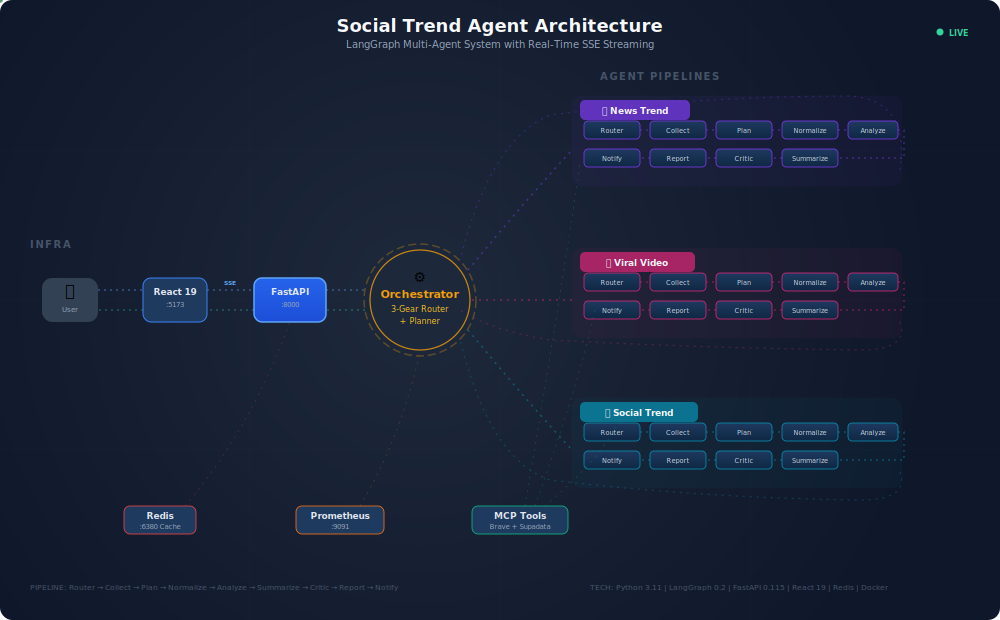
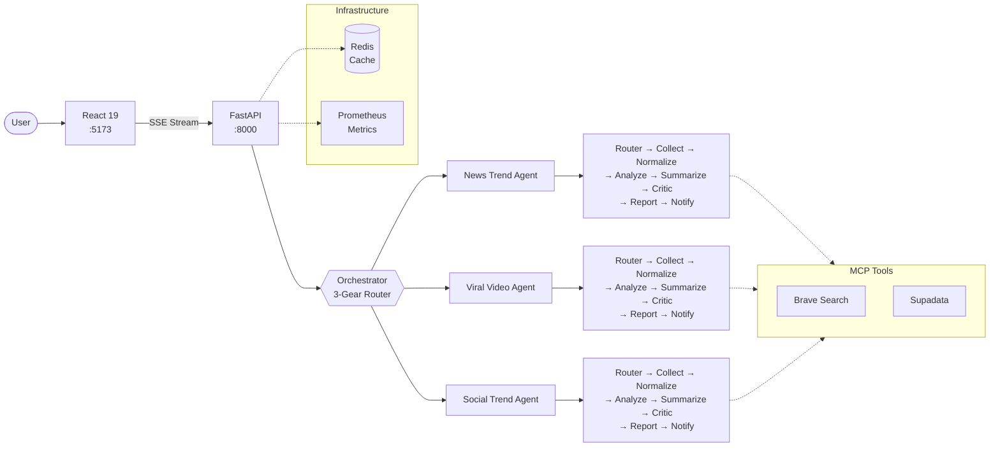

<div align="center">

# Social Trend Agent

### Production-Ready Multi-Agent System for Real-Time Trend Intelligence

_Autonomous AI agents that collect, analyze, and report on trends across news, video, and social media — powered by LangGraph orchestration, MCP tool protocol, and compound AI pipelines._

<br/>

[]()
[](https://www.python.org/)
[](https://langchain-ai.github.io/langgraph/)
[](https://fastapi.tiangolo.com/)
[](https://react.dev/)
[](https://docs.docker.com/compose/)

<br/>

[](https://github.com/rayvoidx/social-trend-agent/actions)
[](./LICENSE)
[](https://github.com/rayvoidx/social-trend-agent/pulls)

</div>

<br/>

<p align="center">
  
</p>

---

> [!NOTE]
> **Beta Release** — Core analysis engine and agent workflows are functional. APIs may evolve between releases. We welcome early adopters and contributors. See the [Roadmap](#roadmap) for planned features.

---

## Why Social Trend Agent?

Most "AI agents" are just LLM wrappers with a system prompt. **Social Trend Agent is different.**

<table>
<tr>
<td width="50%">

### Not This

```
Query → System Prompt → LLM → Output
```

- Single LLM call per request
- No planning or adaptation
- No memory between runs
- Hardcoded tool chains

</td>
<td width="50%">

### This

```
Query → Orchestrator → Plan → Execute
      → Observe → Refine → Report
```

- 3 specialized agents with shared state
- Dynamic planning with DAG execution
- Multi-layer memory (Redis + Vector + Disk)
- MCP protocol for extensible tool access

</td>
</tr>
</table>

### What Makes It Agentic

| Capability        | Implementation                                           | Why It Matters                                      |
| :---------------- | :------------------------------------------------------- | :-------------------------------------------------- |
| **Orchestration** | 3-Gear Router: fast LLM → heuristic → LLM planner        | Routes queries to the right agent at the right cost |
| **Planning**      | LLM-generated DAG plans with step-by-step execution      | Adapts strategy based on query complexity           |
| **Memory**        | L1 In-Memory + L2 Redis + Disk + Pinecone Vectors        | Remembers past analyses, avoids redundant API calls |
| **Tools**         | MCP Protocol (Brave Search, Supadata) + 10+ tools        | Standardized tool access via JSON-RPC 2.0           |
| **Feedback**      | Self-Refinement loop with quality scoring                | Reports improve until they meet quality thresholds  |
| **Multi-Agent**   | News + Video + Social agents with shared LangGraph state | Specialized expertise with coordinated output       |

---

## Architecture

Social Trend Agent uses a **hub-and-spoke architecture** with the Orchestrator at the center, routing queries to three specialized agent pipelines:



Each agent runs a **9-node LangGraph StateGraph** pipeline:

```
Router → Collect → Normalize → [RAG] → Analyze → Summarize → Critic → Report → Notify
  │                                                              │         ▲
  │                                                              └─────────┘
  │                                                          Refine Loop (score < 7)
  └── 3-Gear Routing: Cheap LLM → Keyword Heuristic → LLM DAG Planner
```

---

## Quick Start

### Prerequisites

- Python 3.11+
- At least one LLM API key (OpenAI, Anthropic, or Google)
- Docker & Docker Compose (optional, for full stack)

### Option 1: Docker Compose (Recommended)

```bash
git clone https://github.com/rayvoidx/social-trend-agent.git
cd social-trend-agent

# Configure environment
cp .env.example .env
# Edit .env with your API keys (see Environment Variables below)

# Launch full stack
docker compose up -d
```

| Service    | URL                        | Description            |
| :--------- | :------------------------- | :--------------------- |
| Dashboard  | http://localhost:5173      | React monitoring UI    |
| API        | http://localhost:8000      | FastAPI server         |
| API Docs   | http://localhost:8000/docs | Interactive Swagger UI |
| Prometheus | http://localhost:9091      | Metrics dashboard      |

### Option 2: Local Development

```bash
git clone https://github.com/rayvoidx/social-trend-agent.git
cd social-trend-agent

# Install dependencies (uv recommended)
uv sync
# or: pip install -r requirements.txt

# Configure environment
cp .env.example .env

# Run API server
python main.py --mode web
# API: http://localhost:8000 | Docs: http://localhost:8000/docs
```

### Option 3: CLI Mode

```bash
python main.py --agent news_trend_agent --query "AI regulation trends" --window 7d
```

---

## Agents

### News Trend Agent

Analyzes news coverage volume, sentiment distribution, and extracts key topics with actionable insights.

```bash
python main.py --agent news_trend_agent \
  --query "electric vehicles" \
  --window 7d \
  --language en
```

|                  |                                                                                                            |
| :--------------- | :--------------------------------------------------------------------------------------------------------- |
| **Data Sources** | Brave Search MCP, NewsAPI                                                                                  |
| **Output**       | Sentiment ratios, keyword frequencies, LLM-generated insights                                              |
| **Key Tools**    | `search_news()` `analyze_sentiment()` `extract_keywords()` `summarize_trend()` `retrieve_relevant_items()` |
| **Guardrails**   | `redact_pii()` `check_safety()`                                                                            |

### Viral Video Agent

Detects view/engagement spikes using statistical anomaly detection and identifies viral content patterns.

```bash
python main.py --agent viral_video_agent \
  --query "K-pop" \
  --market US
```

|                  |                                                                                                                  |
| :--------------- | :--------------------------------------------------------------------------------------------------------------- |
| **Data Sources** | YouTube Data API, Supadata MCP (captions)                                                                        |
| **Output**       | Spike detection, success factors, topic clusters                                                                 |
| **Key Tools**    | `fetch_video_stats()` `detect_spike()` (Z-score, threshold: 2.0σ) `topic_cluster()` `generate_success_factors()` |

### Social Trend Agent

Monitors social conversations across multiple platforms with unified schema normalization.

```bash
python main.py --agent social_trend_agent \
  --query "brand sentiment" \
  --sources x instagram rss
```

|                  |                                                                                                                              |
| :--------------- | :--------------------------------------------------------------------------------------------------------------------------- |
| **Data Sources** | X (Twitter), Instagram, Naver Blog, RSS                                                                                      |
| **Output**       | Consumer voice analysis, influencer identification, engagement stats                                                         |
| **Key Tools**    | `fetch_x_posts()` `fetch_instagram_posts()` `normalize_items()` `analyze_sentiment_and_keywords()` `generate_trend_report()` |

---

## Core Patterns

<details>
<summary><strong>Compound AI — Role-Based Model Routing</strong></summary>

Each pipeline node uses the optimal model for its task, balancing cost and capability:

```yaml
# config/default.yaml
agents:
  news_trend_agent:
    model_roles:
      router: gpt-5-mini # Fast, cheap routing decisions
      planner: o3 # Deep reasoning for complex plans
      synthesizer: gpt-5-mini # Quick draft generation
      writer: gpt-5.2 # High-quality final reports
      sentiment: gpt-5-mini # Bulk sentiment classification
      tool: gpt-5-mini # Tool invocation
```

</details>

<details>
<summary><strong>ReAct Loop — Reasoning + Acting</strong></summary>

Each agent operates in a Think → Act → Observe cycle within LangGraph:

```
┌─ Router (Think) ──→ Collect (Act) ──→ Normalize (Observe) ─┐
│                                                              │
│  Reason ◀────────────────────────────────────────────────────┘
│    │
│  Analyze (Act) → Summarize (Act) → Critic (Evaluate)
│                                       │
│    ┌──────── Feedback Loop ◀──────────┘
│    │    (Self-Refinement: score < 7 → retry, max 2x)
│    ▼
│  Report (Write) → Approve (HITL) → Notify (Act)
```

</details>

<details>
<summary><strong>Agentic RAG — Dynamic Retrieval Strategy</strong></summary>

The agent dynamically decides whether and how to use retrieval:

```
Query → Router → should_use_rag: true/false
                    │
                    ├── Vector Search (Pinecone + text-embedding-3-large)
                    ├── Keyword Fallback (BM25-style filtering)
                    └── Hybrid Search (alpha=0.7 weighted combination)
                            │
                            ▼
                      Data Augmentation → LLM with Context → Enhanced Insights
```

</details>

<details>
<summary><strong>Self-Refinement Engine</strong></summary>

Reports are iteratively improved until quality thresholds are met:

```python
from src.core.refine import SelfRefineEngine

engine = SelfRefineEngine(llm_client, max_iterations=3)
result = engine.refine(
    content=initial_report,
    criteria=["factuality", "actionability", "coverage"]
)
# Loops: Generate → Evaluate (score) → Refine (if < 7) → Output
```

</details>

<details>
<summary><strong>Graceful Degradation</strong></summary>

When APIs fail, the system continues with partial results rather than crashing:

```python
from src.core.errors import safe_api_call, PartialResult, CompletionStatus

result = PartialResult(status=CompletionStatus.FULL)
items = safe_api_call(
    "fetch_news",
    fetch_function,
    fallback_value=[],
    result_container=result  # Auto-degrades: FULL → PARTIAL → FAILED
)
```

5-step model fallback chain: Primary → Secondary → Tertiary → Mini → Cached

</details>

<details>
<summary><strong>MCP Data Gateway</strong></summary>

All external data collection uses Model Context Protocol for standardized access:

| MCP Server        | Data Sources                        | Used By              |
| :---------------- | :---------------------------------- | :------------------- |
| `brave-search`    | News articles, web search           | News, Social agents  |
| `supadata-ai-mcp` | YouTube, TikTok, X/Twitter captions | Video, Social agents |

Each server runs as a stdio subprocess communicating via JSON-RPC 2.0:

```json
{
  "mcpServers": {
    "brave-search": {
      "command": "npx",
      "args": ["-y", "@modelcontextprotocol/server-brave-search"],
      "env": { "BRAVE_API_KEY": "${BRAVE_API_KEY}" }
    }
  }
}
```

</details>

---

## API Reference

### Core Endpoints

| Method | Endpoint                  | Description                       |
| :----- | :------------------------ | :-------------------------------- |
| `POST` | `/api/tasks`              | Submit an analysis task           |
| `GET`  | `/api/tasks/{id}`         | Get task status and results       |
| `GET`  | `/api/tasks/{id}/stream`  | SSE stream for real-time progress |
| `GET`  | `/api/insights`           | List all generated insights       |
| `POST` | `/api/missions/recommend` | Generate missions from insights   |
| `GET`  | `/api/health`             | Health check                      |

### Example: Submit a Task

```bash
curl -X POST http://localhost:8000/api/tasks \
  -H "Content-Type: application/json" \
  -d '{
    "agent_name": "news_trend_agent",
    "query": "AI regulation trends",
    "params": {"time_window": "7d"},
    "priority": 1
  }'

# Response
{"task_id": "abc-123", "status": "pending"}
```

### Example: Stream Real-Time Progress (SSE)

```bash
curl -N http://localhost:8000/api/tasks/abc-123/stream

# Events
event: node_complete
data: {"node": "collect", "index": 2, "total": 9, "preview": {"items_collected": 15}}

event: node_complete
data: {"node": "analyze", "index": 4, "total": 9, "preview": {"sentiment": "65% positive"}}

event: complete
data: {"task_id": "abc-123", "status": "completed"}
```

<details>
<summary><strong>All Endpoints</strong></summary>

| Method   | Endpoint                  | Description                 |
| :------- | :------------------------ | :-------------------------- |
| `POST`   | `/api/tasks`              | Submit analysis task        |
| `POST`   | `/api/tasks/batch`        | Submit multiple tasks       |
| `GET`    | `/api/tasks`              | List all tasks              |
| `GET`    | `/api/tasks/{id}`         | Task status / results       |
| `GET`    | `/api/tasks/{id}/stream`  | SSE real-time progress      |
| `DELETE` | `/api/tasks/{id}`         | Cancel task                 |
| `GET`    | `/api/insights`           | List insights (cached 300s) |
| `GET`    | `/api/insights/{id}`      | Single insight              |
| `POST`   | `/api/missions/recommend` | Mission generation          |
| `GET`    | `/api/dashboard/summary`  | Dashboard stats             |
| `GET`    | `/api/health`             | Health check                |
| `GET`    | `/api/metrics`            | Current metrics             |
| `GET`    | `/api/statistics`         | Aggregated stats            |
| `GET`    | `/api/workers`            | Worker pool status          |
| `GET`    | `/metrics`                | Prometheus scrape           |
| `WS`     | `/ws/metrics`             | Real-time metrics (2s push) |
| `POST`   | `/api/web-search`         | Brave Search via MCP        |
| `POST`   | `/api/fetch-url`          | URL content via MCP         |
| `POST`   | `/api/youtube/search`     | YouTube search              |
| `GET`    | `/api/tools`              | Available MCP tools         |
| `POST`   | `/n8n/agent/execute`      | N8N webhook trigger         |

</details>

---

## Environment Variables

| Variable            | Required    | Description                                                            |
| :------------------ | :---------- | :--------------------------------------------------------------------- |
| `LLM_PROVIDER`      | Optional    | Default LLM provider (`openai` \| `anthropic` \| `google` \| `ollama`) |
| `OPENAI_API_KEY`    | Conditional | Required if using OpenAI models                                        |
| `ANTHROPIC_API_KEY` | Conditional | Required if using Anthropic models                                     |
| `GOOGLE_API_KEY`    | Conditional | Required if using Gemini models                                        |
| `BRAVE_API_KEY`     | Recommended | Brave Search for news/web data                                         |
| `SUPADATA_API_KEY`  | Recommended | SNS data (X, TikTok, YouTube captions)                                 |
| `YOUTUBE_API_KEY`   | Optional    | YouTube Data API                                                       |
| `PINECONE_API_KEY`  | Optional    | Vector store for RAG                                                   |
| `REDIS_URL`         | Optional    | Redis connection (default: `redis://localhost:6379`)                   |
| `SLACK_WEBHOOK_URL` | Optional    | Slack notifications                                                    |
| `N8N_WEBHOOK_URL`   | Optional    | N8N workflow integration                                               |

> At least one LLM API key is required. For full functionality, configure Brave + Supadata MCP keys.

---

## Infrastructure

### Docker Compose Stack

```
┌─────────────────────────────────────────────────────────┐
│                   Docker Compose Stack                    │
│                                                          │
│  ┌──────────┐   /api   ┌──────────┐    ┌─────────────┐  │
│  │  React   │ ◄──────► │ FastAPI  │ ◄─►│    Redis    │  │
│  │  :5173   │   SSE    │  :8000   │    │  :6380      │  │
│  │  nginx   │          │ uvicorn  │    │  Cache+State│  │
│  └──────────┘          └────┬─────┘    └─────────────┘  │
│                             │                            │
│                    ┌────────┴────────┐  ┌─────────────┐  │
│                    │  Orchestrator   │  │ Prometheus  │  │
│                    │  ┌────┬────┐   │  │   :9091     │  │
│                    │  ▼    ▼    ▼   │  │  Metrics    │  │
│                    │ News Video Soc │  └─────────────┘  │
│                    │ Agent Pipelines│                    │
│                    └────────────────┘                    │
└─────────────────────────────────────────────────────────┘
```

### Service Health Checks

| Service    | Port | Health Check      | Interval |
| :--------- | :--- | :---------------- | :------- |
| API        | 8000 | `GET /api/health` | 30s      |
| Web        | 5173 | `GET /`           | 30s      |
| Redis      | 6380 | `redis-cli ping`  | 10s      |
| Prometheus | 9091 | `GET /-/healthy`  | 30s      |

### Caching Strategy

| Layer      | Implementation       | TTL     | Purpose                  |
| :--------- | :------------------- | :------ | :----------------------- |
| L1 Memory  | `@cached` decorator  | 1h      | MCP search result dedup  |
| L2 Redis   | `AsyncRedisCache`    | 30-300s | API response caching     |
| Task Store | `RedisTaskStore`     | 24h     | N8N task state tracking  |
| Disk       | `DiskCache` (pickle) | 24h     | Large result persistence |

---

## Report Output

Reports are saved to `artifacts/{agent_name}/{run_id}.md`:

```markdown
# News Trend Analysis Report

## Summary

AI regulation is accelerating across major economies...

## Sentiment Analysis

- Positive: 45% | Neutral: 40% | Negative: 15%

## Top Keywords

1. artificial intelligence (42)
2. machine learning (28)
3. automation (18)

## Key Insights

1. Enterprise adoption is accelerating across sectors
2. Regulatory concerns are emerging in EU and US markets

## Recommended Actions

1. Monitor competitor AI strategy announcements
2. Evaluate internal use cases for automation

## Quality Metrics

| Metric        | Score |
| ------------- | ----- |
| Coverage      | 0.85  |
| Factuality    | 0.92  |
| Actionability | 0.78  |
```

---

## Development

### Running Tests

```bash
# Integration tests
pytest tests/integration/ -v

# Specific agent test
pytest tests/integration/test_news_agent_integration.py -v

# With coverage
pytest --cov=src tests/
```

### Frontend Development

```bash
cd apps/web
npm install
npm run dev
# http://localhost:5173
```

### Project Structure

<details>
<summary><strong>View full directory structure</strong></summary>

```
src/
├── agents/                       # Agent implementations
│   ├── news_trend/               # News analysis
│   │   ├── graph.py              # LangGraph StateGraph
│   │   ├── graph_advanced.py     # Advanced graph (loops/parallel/conditions)
│   │   ├── tools.py              # Data collection & analysis tools
│   │   └── prompts.py            # System prompts
│   ├── viral_video/              # Video trend detection
│   ├── social_trend/             # Social monitoring
│   ├── orchestrator.py           # Agent orchestrator (3-Gear Router)
│   └── stream_utils.py           # SSE streaming utilities
├── api/                          # FastAPI server
│   ├── routes/
│   │   ├── dashboard.py          # Main API routes + SSE streaming
│   │   ├── mcp_routes.py         # Direct MCP tool access
│   │   └── n8n.py                # Webhook integration
│   ├── services/                 # Business logic
│   ├── schemas/                  # Pydantic request/response models
│   └── streaming.py              # TaskStreamManager (pub/sub)
├── core/                         # Core utilities
│   ├── state.py                  # Pydantic state models (AgentState)
│   ├── config.py                 # Config management (multi-LLM)
│   ├── errors.py                 # Error handling + PartialResult
│   ├── refine.py                 # Self-refinement engine
│   ├── checkpoint.py             # Human-in-the-loop support
│   ├── routing.py                # Query routing
│   ├── gateway.py                # API gateway
│   └── planning/                 # Planning module
├── infrastructure/               # Production infrastructure
│   ├── cache.py                  # TTL caching (@cached)
│   ├── retry.py                  # Exponential backoff (@backoff_retry)
│   ├── rate_limiter.py           # Token bucket algorithm
│   ├── distributed.py            # Task queue & workers
│   ├── monitoring/               # Prometheus metrics
│   └── storage/                  # PostgreSQL, Redis
├── integrations/                 # External services
│   ├── llm/                      # Multi-provider LLM client
│   ├── mcp/                      # MCP servers (Brave, Supadata)
│   ├── retrieval/                # Vector store (Pinecone RAG)
│   └── social/                   # Platform clients (X, Instagram)
└── domain/                       # Business models
    ├── models.py                 # Insight, Mission, Creator
    └── schemas.py                # Shared schemas

apps/web/                         # React 19 frontend
├── src/
│   ├── components/               # Dashboard, AnalysisForm, ResultCard
│   ├── hooks/                    # useTaskStream (SSE)
│   ├── api/                      # API client
│   └── types/                    # TypeScript definitions

config/                           # YAML configuration
tests/                            # Unit & integration tests
artifacts/                        # Generated reports
```

</details>

---

## Tech Stack

<table>
<tr>
<td>

**Backend**
| | |
|:--|:--|
| Python | 3.11+ |
| FastAPI | 0.115 |
| LangGraph | 0.2+ |
| LangChain | 0.3 |
| Pydantic | v2 |
| MCP | 1.0+ |

</td>
<td>

**LLMs**
| | |
|:--|:--|
| OpenAI | GPT-5.2, o3 |
| Anthropic | Claude Sonnet 4.5 |
| Google | Gemini 2.5 Pro |
| Embeddings | text-embedding-3-large |
| Voyage AI | voyage-3 |

</td>
<td>

**Frontend**
| | |
|:--|:--|
| React | 19 |
| TypeScript | 5.9 |
| Vite | 5.4 |
| TailwindCSS | 3.4 |
| React Query | 5.x |
| Recharts | 2.12 |

</td>
<td>

**Infrastructure**
| | |
|:--|:--|
| Docker | Multi-stage |
| Redis | 7 Alpine |
| Prometheus | Latest |
| Pinecone | Vector DB |
| NLTK | NLP tools |

</td>
</tr>
</table>

---

## Roadmap

### v0.3 — Current (Beta)

- [x] Multi-agent orchestration with 3-Gear Router
- [x] LangGraph 9-node pipeline per agent
- [x] Compound AI with role-based model routing
- [x] MCP protocol integration (Brave Search, Supadata)
- [x] Self-refinement engine with quality scoring
- [x] Agentic RAG (Pinecone + hybrid search)
- [x] Real-time SSE streaming for task progress
- [x] React 19 dashboard with monitoring
- [x] Docker Compose full-stack deployment
- [x] Prometheus metrics + structured logging

### v0.4 — Next (Planned)

- [ ] Grafana dashboard integration
- [ ] Kubernetes deployment manifests
- [ ] Webhook-based real-time alerts
- [ ] Custom agent plugin architecture
- [ ] Multi-language report generation
- [ ] Advanced visualization in dashboard (charts, timelines)

### v1.0 — Stable (Target)

- [ ] Enterprise SSO / RBAC authentication
- [ ] Horizontal auto-scaling with load balancing
- [ ] PostgreSQL persistent storage migration
- [ ] 80%+ test coverage
- [ ] Comprehensive API documentation
- [ ] Agent marketplace for community-built agents
- [ ] Scheduled recurring analyses (cron-based)
- [ ] White-label dashboard theming

---

## Feature Readiness

| Component             |   Status   | Notes                        |
| :-------------------- | :--------: | :--------------------------- |
| News Trend Agent      | **Stable** | Production-ready pipeline    |
| Viral Video Agent     | **Stable** | Z-score spike detection      |
| Social Trend Agent    | **Stable** | Multi-platform monitoring    |
| Orchestrator (3-Gear) | **Stable** | Routing + planning           |
| FastAPI Server        | **Stable** | Full REST + SSE              |
| React Dashboard       |  **Beta**  | Core features complete       |
| Docker Deployment     | **Stable** | Multi-stage + health checks  |
| SSE Streaming         |  **Beta**  | Node-level progress tracking |
| Prometheus Monitoring |  **Beta**  | Metrics collection active    |
| Agentic RAG           |  **Beta**  | Pinecone integration         |
| Human-in-the-Loop     | **Alpha**  | Checkpoint-based approval    |

---

## Contributing

We welcome contributions from the community. Whether it's a bug fix, new feature, or documentation improvement — every PR matters.

1. Fork the repository
2. Create your feature branch (`git checkout -b feature/amazing-feature`)
3. Commit your changes (`git commit -m 'Add amazing feature'`)
4. Push to the branch (`git push origin feature/amazing-feature`)
5. Open a Pull Request

**New here?** Look for issues labeled [`good first issue`](https://github.com/rayvoidx/social-trend-agent/labels/good%20first%20issue).

---

## License

BSD-3-Clause — see [LICENSE](./LICENSE) for details.

---

<div align="center">

**Built with LangGraph, FastAPI, and React**

If you find this project useful, please consider giving it a star.

[](https://github.com/rayvoidx/social-trend-agent)

</div>
